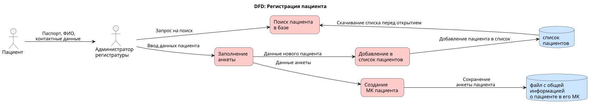
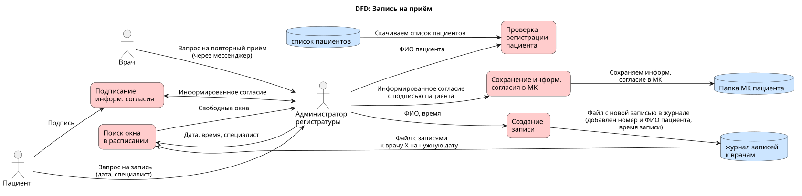
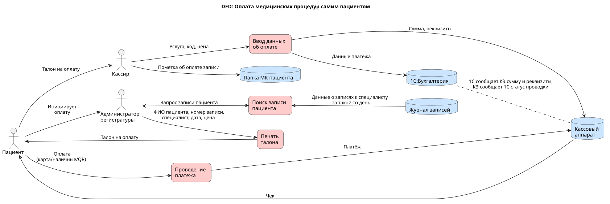
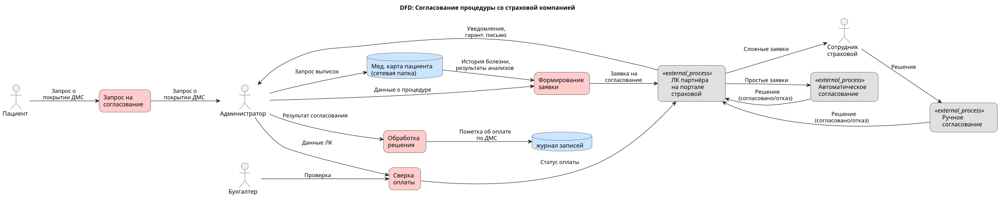
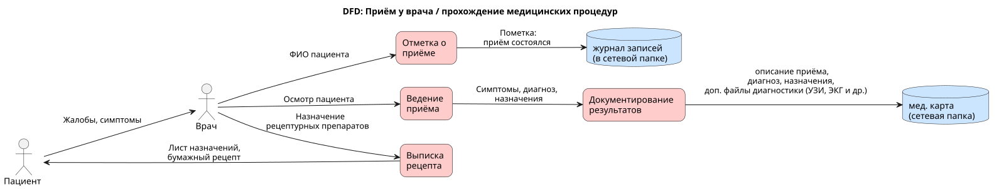
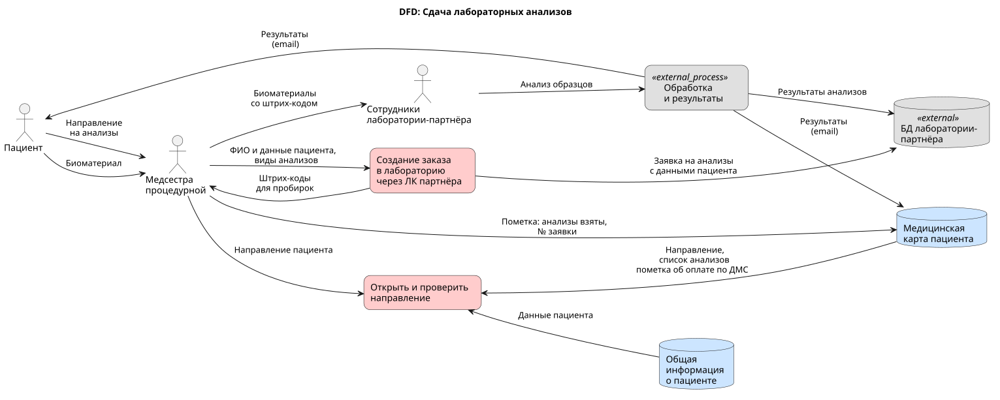

# Задание 1. Анализ безопасности системы

## Задача 1. Выявить конфиденциальные данные, которые не учтены во внутренних системах

### Основные процессы (взаимодействие с пациентом)

* Регистрация пациента  
* Запись на приём  
* Оплата медицинских процедур самим пациентом  
* Согласование медицинских процедур по ДМС  
* Приём у врача / прохождение инструментальных обследований / прочих медицинских процедур  
* Сдача лабораторных анализов

#### Регистрация пациента

Основные участники: пациент, администратор в регистратуре

* Пациент лично приходит в регистратуру, показывает паспорт и говорит свои данные (или диктует данные по телефону, если хочет записаться в первый раз).  
* Администратор открывает файл patients.xlsx со списком пациентов на сетевой папке и ищет там ФИО пациента или его номер паспорта.  
* Администратор заполняет анкету пациента со слов пациента (и с его паспорта).  
* Администратор создаёт папку медкарты пациента на сетевой файловой системе и добавляет туда анкету с информацией о пациенте.  
* Администратор добавляет новую запись в excel-файл со списком пациентов  
  * считаем, что регистрировать новых пациентов приходится не слишком часто, что одновременно работают максимум 2 администратора, что каждый из них видит, что делает другой – и поэтому коллизий с одновременным сохранением данных и затиранием изменений коллег не бывает. Ну, или почти не бывает \= )

#### Запись на приём

Основные участники: пациент, администратор в регистратуре, врач (если записывает пациента на повторный приём)

* Пациент лично приходит в регистратуру / звонит в регистратуру / врач пишет администратору в мессенджер, на какую дату и к какому специалисту нужна запись пациента  
* Администратор открывает файл со списком пациентов patients.xslx и проверяет, что такой пациент уже зарегистрирован.  
* Администратор открывает журнал записей на заданную дату (xlsx-файл в сетевой папке по пути `/Записи/{дата_записи}/{имя_специалиста}.xlsx`), ищет окно в расписании у заданного специалиста – и вносит туда ФИО пациента.  
  * Журнал записей ведётся в формате отдельных xlsx-файлов для каждого специалиста, чтобы было меньше шансов получить коллизию приработе двух администраторов (и затереть только что сделанные записи второго администратора).  
* Если пациент записывается через личную явку – администратор может распечатать для него форму информированного согласия на обследование (если таковая нужна), дать её подписать в бумажной форме, пропустить через сканер – и сохранить её в папке пациента на сетевой файловой системе.

#### Оплата медицинских процедур самим пациентом

Основные участники: пациент, администратор в регистратуре, кассир

* Администратор ищет запись пациента в журнале записей к специалистам.  
* Администратор распечатывает талон на оказание платной медицинской услуги с кодом записи, ценой и кратким описанием (специалист, дата, вид медицинской услуги).  
* Пациент с этим талоном идёт на кассу напротив регистратуры и показывает талон кассиру.  
* Кассир вводит название услуги, код записи и цену в систему “1С:Бухгалтерия”  
* “1С:Бухгалтерия” загружает эти данные в кассовый аппарат.  
* Пациент производит оплату (картой, наличными или QR-кодом).  
* Кассовый аппарат проводит платёж по фискальной системе, печатает чек и отправляет информацию о проводке платежа в систему “1С: Бухгалтерия”.  
* Кассир подшивает к талону чек и передаёт пациенту.

#### Согласование процедуры со страховой компанией

Основные участники: администратор, сотрудник страховой компании

* Пациент получил от врача назначение на процедуры.  
* Пациент спрашивает администратора, покроет ли его ДМС это назначение, или его придётся оплачивать самостоятельно.  
* Администратор заходит в личный кабинет партнёра на портале страховой компании.  
* Администратор формирует заявку на согласование медицинской услуги, заполняя форму заявки.также вводя туда выписки из истории болезни пациента и загружая файлы с результатами анализов.  
* Часть заявок согласуется автоматически (в течение 1 минуты).  
* Часть заявок (например, выше определённой суммы) просматривает сотрудник страховой компании (в течение часа) и выносит решение.  
* В случае согласования в личный кабинет партнёра приходит гарантийное письмо + уведомление о согласовании. В случае отказа – только уведомление об отказе.  
* Получив согласование, администратор делает пометку в журнале записей, что услуга оплачена страховой компанией по ДМС.  
* В конце каждого месяца бухгалтер и администратор совместно проверяют статус оплаты в ЛК партнёра – и поступление денег на счёт.

#### Приём у врача / прохождение инструментальных обследований / прочих медицинских процедур

Основные участники: пациент, врач.

* Пациент приходит к врачу.  
* Врач открывает файл с журналом записи пациентов, находит там запись пациента и помечает, что приём состоялся.  
* Врач открывает папку медицинской карты пациента на сетевой файловой системе и дописывает туда новый файл (описание симптомов + диагноз + лист назначений).  
* Если нужно, туда же добавляются файлы с результатами инструментальной диагностики (рентгеновские снимки, снимки УЗИ, ЭКГ и проч.).  
* Если нужны рецептурные препараты, то врач выписывает их на бумажном бланке.

#### Сдача лабораторных анализов

Основные участники: пациент, медсестра из процедурной, сотрудники лаборатории-партнёра.

* Пациент заходит в процедурную к медсестре с направлением на сдачу анализов.  
* Медсестра открывает файлы медицинской карты пациента на сетевой файловой системе:  
  * файл с общей информацией о пациенте;  
  * файл с направлением на анализы (если нужно, то тауже проверяет, стоит ли там пометка о согласованной оплате по ДМС);  
* Медсестра заходит в ЛК лаборатории-партнёра через веб-интерфейс и создаёт заявку на анализы, заполняя форму ввода (часть данных берёт из файла с общей информацией о пациенте и направления на анализы).  
  * NB: заявка на анализы НЕ анонимная, т.к. требования прослеживаемости образцов.  
* Веб-интерефейс лаборатории генерирует штрих-код.  
* Медсестра печатает штрих-коды и наклеивает на пробирки.  
* Медсестра берёт анализы.  
* Медсестра помечает в МК, что анализы взяты (и указывает № заявки).  
* В конце дня пробирки с анализами передаются в лабораторию.  
* Результаты анализов лаборатория присылает пациенту и клинике по электронной почте.

### Дополнительные процессы

* Закупка и списание ТМЦ.  
* Составления графика дежурств  
* Расчёт и выплата заработной платы.  
* Расчёт и выплаты партнёрам-подрядчикам (в т.ч. клиническим лабораториям) по договорам.  
* Формирование отчётности для государственных органов.  
* Внутренняя аналитическая работа.  
* Передача аналитических данных вовне.

## Задача 2. Аудит мер по обеспечению безопасности данных

### Если лень читать много букв

IT-процессы у клиники застыли на уровне 2003 года. Даже если это небольшая клиника при областном мединституте, это очень неприятно.

#### Проблемы до масштабирования

* Богатейшие возможности по утечке персональных данных. Со всеми вытекающими в виде штрафов и подмоченной репутации, если это получит огласку.  
* Богатейшие возможности по случайному повреждению данных:  
  * например, случайное повреждение списка пациентов, если его одновременно пытаются сохранить оба администратора регистратуры, или случайное повреждение журнала записи, если его пытаются сохранить одновременно администратор (с новой записью) и врач (с пометкой, что пациент принят);  
  * это должно вести к частым сбоям в бизнес-процессах даже сейчас, до развёртывания в сеть.  
* Отсутствие удобных способов записи через сайт / мобильное приложение, что отпугивает многих потенциальных клиентов.

#### Проблемы в случае масштабирования

При развёртывании в сеть клиник текущий IT-ланшдафт столкнётся с массой новых угроз, которые должны быть устранены ещё **до масштабирования.** Это угрозы как для бизнес-процессов, так и для конфиденциальности.

##### Угрозы и риски по бизнес-процессам

**Нынешний IT-ландшафт не позволяет нормально работать при развёртывании сети клиник.**

###### *Если оставляем один сервер на все клиники?*

Предположим, мы завели VPN, объединили наши клиники в виртуальную локальную сеть и пытаемся подключить филиалы к центральному серверу, чтобы они пользовались его сетевыми ресурсами.

* Неизбежны проблемы синхронизации данных между филиалами.  
* Неизбежны сбои во всех филиалах при временной потере связи с центральным сервером:  
  1) сервер один, без малейшего резервирования;  
  2) сервер стоит не в дата-центре с резервированными каналами связи и хорошим SLA, а прямо в клинике.  
* Случайных повреждений данных (в т.ч. при одновременном редактировании) станет на порядок больше, недовольство пациентов резко вырастет. Поиск и устранение этих сбоев отнимать много времени у личного состава.

###### *А если по серверу на каждую клинику?*

* Предположим, у каждого филиала свой список пациентов и журнал записей. И даже своя копия медкарты.  
* Списки пациентов надо синхронизировать вручную в конце рабочего дня (утомляет администраторов).  
* Медкарты надо синхронизировать вручную в конце рабочего дня, что крайне утомительно, и гарантированы потери данных из-за неправильной синхронизации.  
* Будут проблемы с доступом к журналам записей:  
* если открывать их на запись только из своего филиала, то неудобно записываться в другой филиал, а если открыть их на запись из любого филиала, то снова будут коллизии.

##### Риски по утечке данных и прочих нарушениях 152-ФЗ

* С ростом штата возрастает и вероятность утечки.  
* Больше объём ПДн – больше и штрафы. Было до 10000 человек, штраф до 5 миллионов рублей, станет свыше 10000 человек, штраф до 10 млн рублей). Соответсвенно, величина потенциального ушерба вырастает вдвое.  
* Внимание СМИ, конкурентов и контролирующих органов к сети клиник всегда будет больше, чем к одной клинике. Вероятность огласки вырастает.  
* Нужна политика обработки ПДн.  
  1) Хинт: мы вполне можем поддерживтаь удаление ПДн вручную, по запросу на email. И предоставлять полные ПДн тоже вручную по запросу на email (таких запросов вряд ли будет много). Но вот политику опубликовать надо.

Подробное описание проблемных зон и анализ конкретных процессов – ниже

### Проблемные зоны и анализ процессов

Полный анализ проблемных зон представлен в следующих документах:

- **[Проблемные зоны по риску утечки данных](problem_areas_data_leaks.md)** — 10 ключевых проблем с точки зрения ИБ и 152-ФЗ
- **[Сопоставление процессов с требованиями безопасности](processes_vs_security_requirements.md)** — детальный анализ каждого бизнес-процесса

#### Краткое резюме проблемных зон

| № | Проблема | Влияние |
|---|----------|---------|
| 1 | Хранение ПДн в Excel без шифрования | Нарушение 152-ФЗ, риск утечки |
| 2 | Отсутствие разграничения доступа | Любой сотрудник видит все данные |
| 3 | Передача данных партнёрам без контроля | Нет аудита, нет DLP |
| 4 | Использование мессенджеров для ПДн | Неконтролируемый канал |
| 5 | Отсутствие шифрования at rest/in transit | Данные в открытом виде |
| 6 | Нет аудита доступа | Невозможно расследовать инциденты |

#### DFD-диаграммы бизнес-процессов

Ниже представлены диаграммы потоков данных для каждого из основных процессов компании.

##### 1. Регистрация пациента

**Проблемы:**
- **Утечка данных:** ПДн хранятся в незашифрованном `patients.xlsx`, доступном всем сотрудникам
- **Повреждение данных:** коллизии при одновременном сохранении файла двумя администраторами
- **Нет аудита:** невозможно узнать, кто открывал/редактировал файл

##### 2. Запись на приём

**Проблемы:**
- **Утечка данных:** ФИО пациентов передаётся через мессенджеры (неконтролируемый канал)
- **Повреждение данных:** коллизии при одновременном редактировании журнала администратором и врачом
- **Нет онлайн-записи:** нагрузка на регистратуру, конкуренты привлекательнее

##### 3. Оплата медицинских процедур

**Проблемы:**
- **Утечка данных:** талоны содержат ПДн и не защищены
- **Нет разделения обязанностей:** кассир сам вводит данные и подтверждает платёж
- **Масштабирование:** 1С в файловом режиме не выдержит более 5-10 одновременных пользователей

##### 4. Согласование со страховой компанией (ДМС)

**Проблемы:**
- **Утечка данных:** полная история болезни передаётся на внешний портал без контроля
- **Нет минимизации:** передаётся больше данных, чем необходимо для согласования
- **Повреждение данных:** пометка об оплате ДМС в том же файле, который редактируют другие

##### 5. Приём у врача

**Проблемы:**
- **Врачебная тайна:** любой сотрудник может открыть медкарту любого пациента
- **Потеря данных:** нет версионирования, файлы можно редактировать/удалять без следа
- **Повреждение данных:** врач отмечает приём в том же файле, который редактирует администратор

##### 6. Сдача лабораторных анализов

**Проблемы:**
- **Утечка данных:** ПДн и медданные передаются в систему лаборатории-партнёра без контроля
- **Незащищённый канал:** результаты анализов отправляются по обычному email
- **Ненадёжная доставка:** письма могут теряться или попадать в спам

## Задача 3. Что можно улучшить?

### Механизм тегирования данных

Для самого начала – мы можем просто считать все данные из МК пациентов – строго конфиденциальными. И запрещать раздавать их вовне, хотя бы формально. А раздавать внутри организации не запрещать.

Чтобы усложнить себе жизнь на перспективу:

- считаем, что часто будет нужно прибегать к внешней консультации и раздавать данные вовне;  
- считаем, что с увеличением штата доступ к диагнозам пациента должен иметь только его лечащий врач;  
- считаем, что мы хотим развивать направление бизнес-аналитики, и иногда тоже раздавать данные вовне (например, показывать их бизнес-аналитикам материнской компании).

Для управления данными и тегирования будем использовать каталог OpenMetadata.

Для аналитических задач будем использовать ClickHouse. У нас там будут следующие слои данных:

- `raw_sources`: сырые текстовые данные, импортированные из МК пациентов (содержат ПД, прямой доступ извне к ним запрещён), для которых мы будем выставлять теги `pii` для идентифицирующих полей;  
- `raw_sources_with_tokenization`: источники с дополнительными полями, где кроме идентифицирующих полей вроде “email” или “телефон” добавлены поля “токен адреса” или “токен телефона” (с помощью нашего ETL-процесса, вероятно с применением внешней DLP), этим полям выставляется тег `pii_hidden`.  
  - для всех прочих полей, пришедших из исходных таблиц, также вводятся поля `.{source_fld_name}_pii_hidden`, где идентифицирующая информация найдена и удалена нашим ETL-процессом (этим полям выставляется тег `pii_hidden`).  
- `dlp_approved_sources`: копия raw\_sources\_with\_tokenization после сканирования DLP-системой:  
  - DLP-система копирует только поля с тегом `pii_hidden`;  
  - перед копированием инкремента данных DLP-система удостоверится, что в этих полях точно нет идентифицирующих данных;  
  - если есть идентифицирующие данные, то копирования не произойдёт, и дата-инженеру придётся доработать код токенизации на предыдущем шаге.

Для аналитики раздаём вовне только `dlp_approved_sources`. К остальным схемам даём доступ для роли “admin” или “pii\_read”.

Для файлов в файлохранилище тоже введём набор тегов, которые тоже будем хранить в OpenMetadata.

- `scanned_by_dlp`: для файлов, которые уже просмотрены нашей DLP-системой;  
- `pii_found`: для файлов, где DLP-система нашла идентифицирующие поля;  
- `pii_not_found`: для файлов, где не найдено идентифицирующих данных;  
- `pii_auto_hidden`: для обезличенных файлов, где идентифицирующие данные автоматически скрыты DLP-системой (например, рентгеновские снимки, где подписи с ФИО пациента автоматически заменены на подписи с его ID).

Вовне (для целей аналитики или внешней консультации) разрешим раздавать только файлы с тегом `scanned_by_dlp` and (`pii_not_found` or `pii_auto_hidden`).
Для таких файлов будем создавать отдельную роль со временным доступом и авторизовывать через наше Auth Proxy.