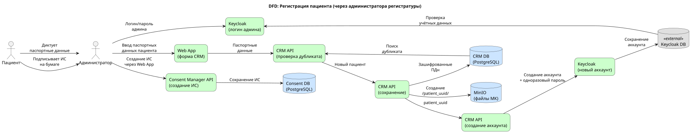

# Задание 2. Проектирование решения

## C4-диаграммы контейнеров

| Диаграмма | PlantUML | SVG | Описание |
|-----------|----------|-----|----------|
| AS-IS | [c4_container_as_is.puml](c4_container_as_is.puml) | [c4_container_as_is.svg](c4_container_as_is.svg) | Текущая архитектура до трансформации |
| TO-BE | [c4_container_to_be.puml](c4_container_to_be.puml) | [c4_container_to_be.svg](c4_container_to_be.svg) | Целевая архитектура после трансформации |

### AS-IS: текущая архитектура


### TO-BE: целевая архитектура


## Новые элементы архитектуры: основная часть

Здесь на нашу диаграмму контекстов добавятся следующие сервисы (основную часть сервисов развернём в kubernetes, арендовав под это несколько [серверов](https://selectel.ru/services/dedicated/config/?uuid=6b1f8b59-6cb0-415d-9b34-e88ddfd6fc0f) в дата-центра, kuberntes на сервера поставим сами).

### CRM API

Этот сервис работает со следующими данными:

- паспортные данные пациентов;  
- записи пациентов (к какому специалисту и на какое время);  
- данные сотрудников клиники / сети клиник;  
- данные о расписании сотрудников.

#### Ограничения по доступу к данным

Проверка пользователя и его роли: здесь мы проверяем JWT и смотрим, что у него есть роль “doctor”, “nurse” или “receptionist”. Или – что пользователь запрашивает инфу о себе самом.

При поиске пациентов по части фамилии / телефона / паспорта – нужно возвращать не более 30-50 строк (чтобы труднее было скопировать базу пациентов полностью). Это будем делать внутри сервиса.

Количество запросов в секунду от одного пользователя будем ограничивать извне:

- или через Istio Ingress Controller (если будем использовать istio);  
- или просто в нашем API Gateway / авторизующего прокси.

Логируем все запросы + заголовки (но не ответы) в ElasticSearch.

### Med Record API

Это сервис управления медицинскими картами пациентов со всеми клиническими данными, как-то:

* протоколы приёмов;  
* диагнозы и назначения;  
* рецепты;  
* ссылки на медицинские документы в MinIO (документы раскладываются по папкам с `patient_uuid`).

#### Ограничения по доступу к данным

Проверка пользователя и его роли: здесь мы проверяем, что к медкарте пытается доступиться или сам пациент (см. UUID юзера по JWT), или юзер с ролью “врач” в JWT. Это перестраховка, т.к. эти вещи уже должны быть проверены на уровне API Gateway / авторизующего прокси (и там ещё и должно быть проверено, что у врача есть действующее информированное согласие) – но не повредит.

Количество обрабатываемых запросов в секунду от одного пользователя будем ограничивать извне:

- или через Istio Ingress Controller (если будем использовать istio);  
- или просто в нашем API Gateway / авторизующего прокси.

Логируем все запросы + заголовки (но не ответы) в ElasticSearch.

### Consent Manager API

Этот сервис будет управлять информированным согласием (ИС) пользователей на доступ к его персональным данным из медицинской карты. ИС будет иметь следующую структуру:

* время выдачи ИС;
* время начала ИС (если NULL, то от самого сотворения мира);  
* время истечения ИС (если NULL, то до конца времён);  
* UUID пациента, который его выдал;  
* UUID специалиста, для которого он выдан (если NULL, то считаем, что выдано всем врачам и специалистам);  
* UUID специалиста, который создал ИС (если его создал не сам пациент через веб-приложения, а администратор в регистратуре);  
* время отзыва ИС пользователем (если NULL, то считаем, что оно не отзывалось).
* признак "разрешаю передачу данных в страховую компанию"
* максимальный срок давности данных, которые я разрешаю к передаче (если NULL, то разрешено за любой срок).

Индексируемся по: (пациенту, врачу, времени истечения ИС)

Частые запросы:

* `GET /consents/{patient_uuid}/{specialist_uuid}?active_now=true&include_null_specialist=true` (наш API Gateway или авторизующий прокси будет обращаться именно сюда).  
* `PUT /consents/{patient_uuid}/specialist_uuid` – выдача информированного согласия на какое-то время (по умолчанию при записи через регистратуру – выдавать всем специалистам на 30 дней).

Основная БД будет Postgres, кэшировать ИС будем в Redis (в течение суток).

Если нужно, устаревшие и деактивированные ИС будем переносить в отдельную архивную Postgres-таблицу для ускорения индексов в основной.

#### Методы защищённого хранения данных

* Хешируем ключи в Redis c какой-нибудь salt.  
* Значения в Redis будем шифровать с помощью FERNET.  
* Соль и ключи держим в Vault.

### Auth Proxy

В прошлый раз, для вящей сохранности медицинских данных, нам предъявили жёсткие требования: не хранить Refresh Token на стороне пользователя, а хранить строго на стороне сервера. В прошлый раз я проектировал для этого т.н. авторизующее прокси, которое полностью берёт на себя общение с Keycloak, а юзеру только выставляет специальное куки `session_id`.

Воспользуемся этим же приёмом и в этот раз, благо одновременная нагрузка у нас ожидается небольшой.

Но: в этот раз наше прокси будет не просто навешивать JWT от keycloak на его запросы, передавая их дальше к нижележащим сервисам. В этот раз (хотя бы перед проксированием Med Record API и MinIO) мы будем обращаться к Consent Manager API – и искать, есть ли у юзера действующее информированное согласие на доступ к данным. Исключение – если юзер сам пациент и просматривает свои собственные данные.

* Если у нас роль “receptionist” – отказываем сразу.  
* Если роль “nurse” или “doctor” – ищем по пациенту действующее информированное согласие на специалиста (или общее).  
* Если роль “patient” – проверяем, что пациент пытается доступиться конкретно к своим данным.

Соответственно, у нас здесь не чистый RBAC, а гибридная модель (RBAC + ABAC).

Токены держим в Redis.

#### Методы защищённого хранения данных

* Хешируем ключи в Redis c какой-нибудь salt.  
* Значения в Redis будем шифровать с помощью FERNET.  
* Соль и ключи держим в Vault.

### Keycloak Identity Provider

Для личного состава клиники или сети – добавляем User Federation по нашему Active Directory.

### MinIO

Здесь мы будем хранить разнообразные документы, прикладываемые к медицинским картам пациентов.

Документы разложим по папкам вида `/patient_uuid/`

На уровне самого MinIO доступ сделаем публичным, регулировать доступ к нему всё равно будет наше Auth Proxy.

### Vault

Используем его для хранения ключей и паролей.

### ElasticSearch

Используем его для хранения логов от всех подов.

### Сервисы НЕ в kubernetes

#### Active Directory

Она требует Windows, под неё арендуем отдельную [Windows-VPS.](https://selectel.ru/services/cloud/servers/vps-windows/)

#### Сервисы 1С

* “1C: Бухгалтерия”: переходим в клиент-серверный режим с размещением сервера приложений в дата-центре.  
* “1С: Склад: тоже переходим в клиент-серверный режиме с размещением сервера приложений в дата-центре.

На kubernetes развернуться не получится: если любой сервер “1С: Приложение” стартует на другой ноде, чем стартовал в прошлый раз, нужно вручную вводить новый ПИН-код (и их дают ограниченное количество). Т.е. легко и незаметно перепрыгивать с ноды на ноду, чем славен kubernetes, мы не сможем.

Для них арендуем парочку Linux-VPS средней мощности.

## Аналитический слой для работы с данными

Здесь добавятся сервисы: ClickHouse, Apache Airflow и OpenMetadata. Всё размещаем в Kubernetes.

**Важно:** для передачи данных во внешнюю аналитику файлы в MinIO тоже будут обезличиваться. Подробности — в разделе про [движок классификации данных](../task_6_data_classification_engine/README.md).

### ClickHouse

Используем её в качестве аналитической БД (чтобы не нагружать транзакционные БД аналитическими запросами при составлении отчётов).

### Слои данных в ClickHouse

В ClickHouse организуем три слоя данных:

| Слой | Описание | Доступ |
|------|----------|--------|
| `raw_data` | Копия данных из транзакционных БД (с ПДн) | admin, pii_read |
| `anonymized` | Обезличенные данные + поля `dlp_approved`, `dlp_comment`, `dlp_error` | admin, analyst |
| `dlp_approved` | Только строки с `dlp_approved=true` (гарантированно без ПДн) | analyst, external_analyst |

### Apache Airflow и ETL-пайплайн

Сделаем **еженощный ETL-пайплайн** через Apache Airflow. Запускать будем каждый день и именно ночью, когда нагрузка на транзакционные БД минимальна.

**Операторы DAG:**

1. **Проверка схемы** — сравнивает текущую схему транзакционных БД со схемой в ClickHouse. Если схема изменилась:
   - DAG падает с ошибкой
   - Отправляется уведомление IT-директору и бизнес-аналитику
   - Требуется ручная миграция схемы в ClickHouse и обновление скриптов обезличивания

2. **Копирование инкремента в raw_data** — SELECT изменённых данных из PostgreSQL → INSERT в ClickHouse (`raw_data`)

3. **Обезличивание данных** — запуск Classification Engine:
   - Токенизация ПДн (хеширование ФИО, email, телефон)
   - При необходимости — вызов облачной LLM для обезличивания адресов
   - Результат сохраняется в слой `anonymized`
   - Добавляются поля: `dlp_approved` (true/false/null), `dlp_comment`, `dlp_error`

4. **Проверка DLP** — вызов InfoWatch Traffic Monitor:
   - Выполняется in-place над слоем `anonymized`
   - DLP маркирует записи, где обнаружены остаточные ПДн
   - UPDATE `dlp_approved`, `dlp_comment`, `dlp_error`

5. **Копирование в dlp_approved** — копирование только тех строк, где `dlp_approved=true`

```
┌─────────────────────────────────────────────────────────────────────────────┐
│                         Airflow DAG (еженощно)                              │
│                                                                             │
│  ┌─────────────┐   ┌─────────────┐   ┌─────────────┐   ┌─────────────┐      │
│  │ 1. Проверка │──▶│ 2. Копиров. │──▶│ 3. Обезлич. │──▶│ 4. DLP      │      │
│  │    схемы    │   │   raw_data  │   │   Engine    │   │   проверка  │      │
│  └─────────────┘   └─────────────┘   └─────────────┘   └──────┬──────┘      │
│         │                                                     │             │
│         ▼ (ошибка)                                            ▼             │
│  ┌─────────────┐                                       ┌─────────────┐      │
│  │ Уведомление │                                       │ 5. Копиров. │      │
│  │ IT-директор │                                       │ dlp_approved│      │
│  └─────────────┘                                       └─────────────┘      │
└─────────────────────────────────────────────────────────────────────────────┘
```

### OpenMetadata

Это средство мы будем использовать в качестве каталога данных для тегирования полей в БД.

### Classification Engine

Собственный сервис классификации данных (см. подробнее в [task_6_data_classification_engine](../task_6_data_classification_engine/README.md)):
- Автоматическое обнаружение ПДн в текстовых полях
- Токенизация идентифицирующих полей (SHA-256, FPE)
- При необходимости — вызов облачной LLM для обезличивания адресов
- Интеграция с InfoWatch DLP для финальной проверки

## Сервисы материнской компании (SOC)

Для обеспечения информационной безопасности используем **сторонние сервисы материнской компании**, развёрнутые в их SOC (Security Operations Center).

### MaxPatrol SIEM (Positive Technologies)

Система управления событиями информационной безопасности:
- Сбор событий из ElasticSearch (логи всех сервисов)
- Сбор событий аутентификации из Auth Proxy
- Корреляция событий, обнаружение аномалий
- Формирование инцидентов ИБ

Интеграция:
- ElasticSearch → MaxPatrol (Syslog/API)
- Auth Proxy → MaxPatrol (Syslog)

### InfoWatch Traffic Monitor (DLP)

Система предотвращения утечек данных:
- Сканирование файлов в MinIO через ICAP-протокол
- Проверка выгрузок из ClickHouse перед передачей вовне
- Интеграция с Classification Engine для верификации токенизации

Интеграция:
- MinIO → InfoWatch (ICAP)
- Classification Engine → InfoWatch (REST API)
- ClickHouse → InfoWatch (аудит выгрузок)

## Тегирование данных

### Тегирование данных в транзакционных БД

Для полей наших транзакционных PostgreSQL-БД вводим следующую классификацию тегов в OpenMetadata:

* `identifying_fields`: идентифицирующие поля (например, ФИО и email), их надо хранить хотя бы в отдельной схеме в зашифрованном виде – и никогда не вытаскивать более 30-50 записей;  
* `extra_protected_fields`: особо охраняемые поля (например, метка о ВИЧ-статусе) – они не относятся к идентифицирующим, но тоже надо шифровать и просто так не показывать;  
* `med_record_fields`: поля медкарты: поля, которые относятся к медкарте, их нужно просто не показывать сотрудникам регистратуры, а показывать только лечащему врачу (другим врачам тоже не показывать);  
* `dlp_needed`: поля, которые надо прогонять через DLP-систему на предмет того, не указал ли кто из врачей, например, ФИО пациента в поле "назначение", заполняя протокол приёма;  
* `dlp_not_needed`: поля, которые можно не прогонять через DLP.

### Тегирование данных в аналитических БД (ClickHouse)

Исходные предпосылки:
- считаем, что часто будет нужно прибегать к внешней консультации и раздавать данные вовне;  
- считаем, что с увеличением штата доступ к диагнозам пациента должен иметь только его лечащий врач;  
- считаем, что мы хотим развивать направление бизнес-аналитики, и иногда тоже раздавать данные вовне (например, показывать их бизнес-аналитикам материнской компании).

Для аналитических задач используем ClickHouse. Слои данных:

- `raw_sources`: сырые текстовые данные, импортированные из МК пациентов (содержат ПД, прямой доступ извне к ним запрещён), для которых мы будем выставлять теги `pii` для идентифицирующих полей;  
- `raw_sources_with_tokenization`: источники с дополнительными полями, где кроме идентифицирующих полей вроде "email" или "телефон" добавлены поля "токен адреса" или "токен телефона" (с помощью нашего ETL-процесса, вероятно с применением внешней DLP), этим полям выставляется тег `pii_hidden`.  
  - для всех прочих полей, пришедших из исходных таблиц, также вводятся поля `.{source_fld_name}_pii_hidden`, где идентифицирующая информация найдена и удалена нашим ETL-процессом (этим полям выставляется тег `pii_hidden`).  
- `dlp_approved_sources`: копия raw\_sources\_with\_tokenization после сканирования DLP-системой:  
  - DLP-система копирует только поля с тегом `pii_hidden`;  
  - перед копированием инкремента данных DLP-система удостоверится, что в этих полях точно нет идентифицирующих данных;  
  - если есть идентифицирующие данные, то копирования не произойдёт, и дата-инженеру придётся доработать код токенизации на предыдущем шаге.

Для аналитики раздаём вовне только `dlp_approved_sources`. К остальным схемам даём доступ для роли "admin" или "pii\_read".

### Тегирование файлов в файлохранилище (MinIO)

Для файлов в файлохранилище тоже введём набор тегов, которые тоже будем хранить в OpenMetadata:

- `scanned_by_dlp`: для файлов, которые уже просмотрены нашей DLP-системой;  
- `pii_found`: для файлов, где DLP-система нашла идентифицирующие поля;  
- `pii_not_found`: для файлов, где не найдено идентифицирующих данных;  
- `pii_auto_hidden`: для обезличенных файлов, где идентифицирующие данные автоматически скрыты DLP-системой (например, рентгеновские снимки, где подписи с ФИО пациента автоматически заменены на подписи с его ID).

Вовне (для целей аналитики или внешней консультации) разрешим раздавать только файлы с тегом `scanned_by_dlp` and (`pii_not_found` or `pii_auto_hidden`).
Для таких файлов будем создавать отдельную роль со временным доступом и авторизовывать через наше Auth Proxy.

## Автоматизированный контроль доступа к данным

На этом этапе должен появиться набор юнит-тестов, которые будут делать к нашему REST API запросы с попыткой вытащить те данные, которые не должно быть можно вытащить. Например, если тётенька из регистратуры попытается получить всех пациентов, последовательно вводя первые слоги фамилий – или если дяденька-доктор попытается получить доступ к чужим пациентам.

Перед каждым релизом стоит запускать LLM класса Claude Sonnet, которая будет проверять соответствие набора юнит-тестов — и набора тегов в OpenMetadata. И давать свой вердикт: не надо ли нам добавить юнит-тестов, потому что какие-то поля или таблицы остались непокрытыми.

## Процессы и DFD в новой архитектуре

Ниже описаны основные бизнес-процессы в новой архитектуре с диаграммами потоков данных.

### 1. Регистрация пациента.

Основные участники: пациент, CRM API, Consent Manager API, Keycloak, Google Authenticator.

* Пациент регистрируется через веб-приложение и вводит данные в форму регистрации.
* Пациент передаёт email и телефон в Keycloak.
* Пациент передаёт паспортные данные в CRM API.
* Пациент передаёт информированное согласие в Consent Manager API.
* Consent Manager API сохраняет информированное согласие пациента в свою базу.
* Keycloak передаёт в Google Authenticator одноразовый TOTP/HOTP credential.
* CRM API внутри себя проверяет, нет ли дубликата (поиск по телефону/email/паспорту).
* CRM API сохраняет паспортные данные в PostgreSQL (идентифицирующие данные — в зашифрованном виде).
* CRM API создаёт запись о пациенте в MinIO по UUID юзера (папка для будущих документов МК).


---

### 1.1. Регистрация пациента через регистратуру
Основные участники: пациент, администратор, CRM API, Keycloak.

* Пациент диктует регистратору паспортные данные.
* Администратор входит в Keycloak под своим аккаунтом, передав свой логин и пароль.
* Администратор входит в веб-интерфейс CRM API, вводя в систему паспортные данные пациента.
* CRM API внутри себя проверяет, нет ли дубликата (поиск по телефону/email/паспорту).
* CRM API обращается в keycloak и создаёт новый аккаунт с одноразовым паролем для пациента.
* CRM API сохраняет паспортные данные нового пациента в PostgreSQL (идентифицирующие данные — в зашифрованном виде).
* CRM API создаёт запись о пациенте в MinIO по UUID юзера (папка для будущих документов МК).
* При личном визите в клинику пациент подписывает информированное согласие на бумажке.
* Администратор обращается в Consent Manager API и создаёт информированное согласие на пациента.
* Consent Manager API сохраняет информированное согласие на пациента в свою базу.



---

### 2. Запись на приём

Основные участники: пациент, Auth Proxy, Consent Manager API, CRM API. 

* Пациент записывается через веб-приложение, обращаясь к CRM API через Auth Proxy (передавая ему UUID пациента, UUID специалиста, время записи).
* Auth Proxy добавляет к заголовкам JWT с параметрами пользователя, его ролями и др.
* CRM API проверяет наличие пациента и создаёт запись в таблице `appointments` с временем записи, UUID пациента и UUID специалиста.
* Фронтэнд на стороне пациента обращается к Consent Manager API (через Auth Proxy), проверяя, есть ли на этого специалста информированное согласие.
* Если пациент не подписывал информированое согласие на этого специалиста, то он должен подписать информированное согласие.
* Уведомление отправляется пациенту (email/SMS через внешний сервис).


---

### 3. Оплата медицинских процедур

Основные участники: пациент, кассир, CRM API, Auh Proxy, ККМ.

* Кассир находит запись пациента через CRM (поиск по ФИО / телефону / времени записи).
* Кассир формирует счёт, номер записи передаётся в 1С:Бухгалтерия (пока вручную).
* 1С загружает данные в ККМ, пациент оплачивает.
* Кассир выдаёт пациенту чек.
* Кассир помечает запись как оплаченную в CRM.


Здесь кассир, по крайней мере, может быстро самостоятельно найти запись в CRM API и проверить, что оплачивает (и оплатить теперь можно, не нагружая администратора печатью талона на оплату).

NB: оплата пока всё равно только через ККМ, но не так страшно: пациент всё равно ходит в клинику ногами, это не телемедицина.

---

### 4. Согласование процедуры со страховой (ДМС)

Основные участники: пациент, администратор, страховая компания, CRM API, Auth Proxy, Med Record API

Если это небольшая клиника / маленькая сеть, то заявку заполняет один из администраторов регистратуры с ролью `insurance_coordinator` (такая роль может быть не у всех администраторов).

* Администратор в CRM находит запись пациента с признаком "требует согласования со страховой".
* Администратор щёлкает кнопку "Сформировать заявку" на фронтэнде CRM.
* Фронтэнд подключается к Consent Manager, проверяя, что на пациенте есть действующее ИС с правом передачи данных в страховую (и с каким-то максимальным сроком давности, если он его выставлял).
* Фронтэнд подключается к CRM API (за номером договора ДМС пациента и другими данными, нужными для заполнения заявки) и к Med Record API (за данными из медкарты) запрашивая у них данные для заявки не напрямую, а через Auth Proxy:
  * Auth Proxy ещё раз проверяет, есть ли у пользователя права на доступ -- и есть ли действующее информированное согласие с правом передачи данных в страховую.
  * Если ИС есть, то Auth Proxy навешивает на запросы пользователя JWT с ролями и проксирует запросы к CRM API и Med Record API.
  * CRM API возвращает номер договора с ДМС (считаем, что остальные данные пациента у страховой уже есть, и передавать по новой их не надо).
  * Med Record API возвращает часть клинических данных (не все, а только те, которые нужны для этой заявки).
* Администратор вручную вводит данные на портале страховой.
* Если страховая подтвердила, то администратор в CRM вручную выставляет признак "согласована страховой".
* Все передаваемые данные и запросы логируются для аудита.
 


**Оставшиеся риски:**
- Данные передаются не полностью автоматически: их нужно показывать администратору, который лишний раз видит клинические данные пациента.

---

### 5. Приём у врача

Основные участники: пациент, врач, CRM API, Med Record API, Auth Proxy, Consent Manager API.

* Врач через Auth Proxy пытается подключиться к Med Record API и посмотреть предыдущие протоколы приёмов пациента
* Auth Proxy проверяет действующее наличие действующего информированного согласия через Consent Manager API.
* При наличии согласия врач получает доступ к МК пациента через Med Record API (если в ИС указан срок давности -- то за такое-то время), Med Record API подгружает данные из своей Postgres-базы (Med Record DB).
* Если нужно, врач открывает файлы из MinIO, доступ с фронтэнда через Auth Proxy, с тем же механизмом проверки наличия действующего ИС через Consent Manager API.
* Врач добавляет протокол приёма, диагноз, назначения — Med Record сохраняет данные в PostgreSQL (Med Record DB).
* Документы (снимки, файлы) загружаются в MinIO в папку с UUID пациента, доступ с фронтэнда через Auth Proxy.
* Все действия логируются в ElasticSearch с указанием врача и времени.


**Оставшиеся риски:**
- **Человеческий фактор:** врач всё равно легко может внести некорректные данные, т.к. нормальных шаблонов медицинских документов у нас нет, это отдельная печальная песня.

---

### 6. Сдача лабораторных анализов

Основные участники: администратор или врач, пациент, медсестра, CRM API, Med Record API, Consent Manager API, лаборатория-партнёр.


* Администратор (когда пациент приходит в регистратуру) или врач (в конце приёма) открывает CRM и создают пациенту направление на сдачу анализов.
* CRM сохраняет это направление в свою БД.
* Также администратор или врач распечатывают направление на сдачу анализов и торжественно вручают пациенту.
* Пациент заходит в процедурку aka пункт сбора биоматериалов и показывает направления медсестре.
* Медсестра открывает CRM и находит там эти направления, а потом жмёт у себя на фронтэнде кнопку: "Создать заявку на анализы".
* Фронтэнд подключается к Auth Proxy, а через них к Consent Manager API, CRM API и Med Record API.
  * подгружаем данные о направлении на анализы из CRM API
  * подгружаем дополнительные клинические данные (если таковые имеются) из Med Record API.
  * показываем на это медсестре на экране  (+ пометку о согласованной оплате по ДМС, если есть);  
* Медсестра заходит в ЛК лаборатории-партнёра через веб-интерфейс
  * медсестра заполняет  заявку на анализы, заполняя форму ввода и вводя туда данные для заявки;  
    * NB: заявка на анализы НЕ анонимная, т.к. требования прослеживаемости образцов.  
  * веб-интерефейс лаборатории генерирует штрих-код для пробирки.  
  * Медсестра печатает штрих-коды и наклеивает на пробирки.  
* Медсестра берёт анализы.  
* Медсестра помечает в CRM, что анализы взяты (и указывает № заявки).  
* В конце дня пробирки с анализами передаются в лабораторию. 
* Результаты анализов лаборатория по-прежнему присылает пациенту и клинике по электронной почте.
* Когда клиника получает результаты анализов по почте, то администратор или медсестра их вносят в электронную медкарту пациента через Med Registry API (вручную, через отдельную страницу CRM).


**Оставшиеся риски:**
- Передача данных партнёру: данные минимизированы, но ФИО всё равно передаётся (требования прослеживаемости).
- Медсестре всё равно могут показывать какие-то дополнительные клинические данные, чтобы она могла их скопировать в форму заявки лаборатории-партнёра.

---

### 7. Внутренняя аналитическая работа

Основные участники: главврач, бизнес-аналитик, ClickHouse

* Главврач запрашивает отчёт у бизнес-аналитика.
* Бизнес-аналитик работает **только с ClickHouse** (слой `dlp_approved_sources`), где данные обезличены.
  * Отчёты формируются из одного места.
  * Отчёты формируются без доступа к идентифицирующим данным.
  * Отчёты формируются дополнительной нагрузки на транзакционные БД.
* Все запросы к ClickHouse логируются.


**Оставшиеся риски:**
- **Качество обезличивания:** если ETL некорректно токенизирует данные, ПДн могут попасть в `dlp_approved_sources`
- **Человеческий фактор:** аналитик всё равно может попросить прямой доступ к `raw_sources` ; )

---

### 8. Передача аналитических данных вовне

Основные участники: внешний аналитик, бизнес-аналитик клиники, DLP-система, ClickHouse.

* Внешний аналитик запрашивает данные.
* Бизнес-аналитик формирует выгрузку из ClickHouse (только `dlp_approved_sources`).
* Выгрузка проходит через DLP-систему, которая проверяет отсутствие ПДн.
* Если DLP одобрила — данные передаются через защищённый канал (SFTP/API с mTLS).
* Внешнему аналитику создаётся временная роль с ограниченным сроком доступа.
* Все передачи данных логируются для аудита.


**Оставшиеся риски:**
- **Обход DLP:** при ошибке в DLP-правилах ПДн могут быть переданы
- **Контроль после передачи:** после передачи данных контроль над ними теряется