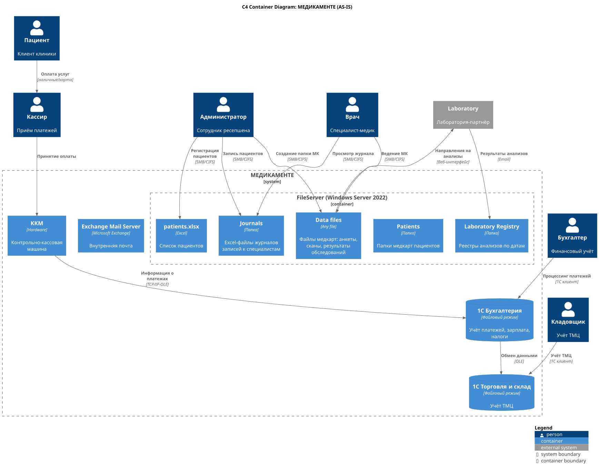
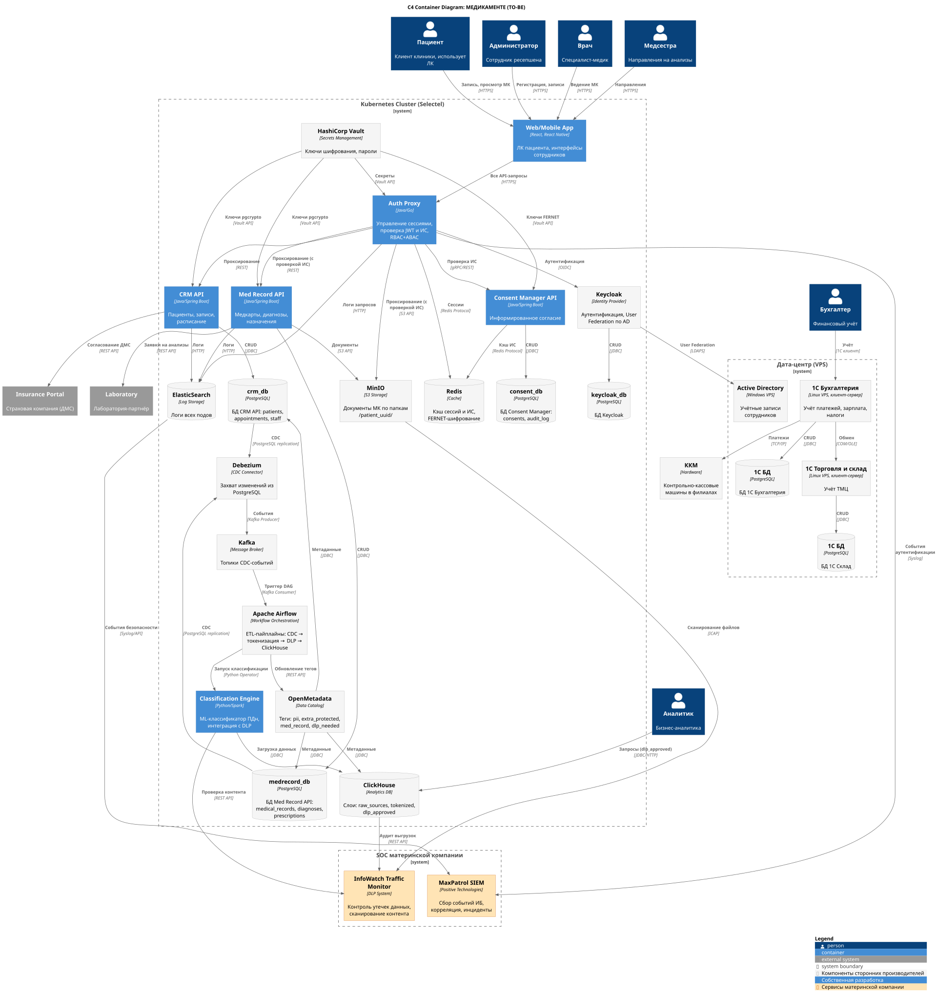
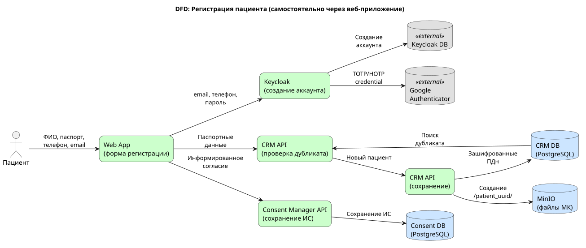
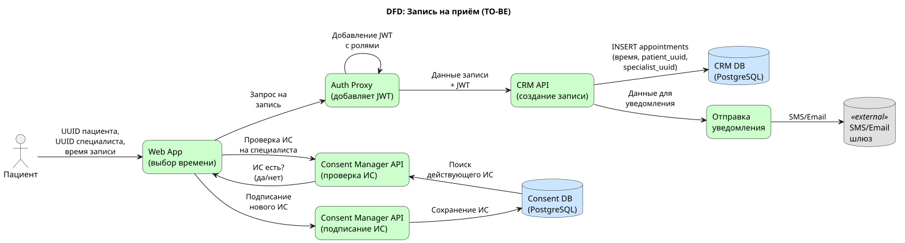
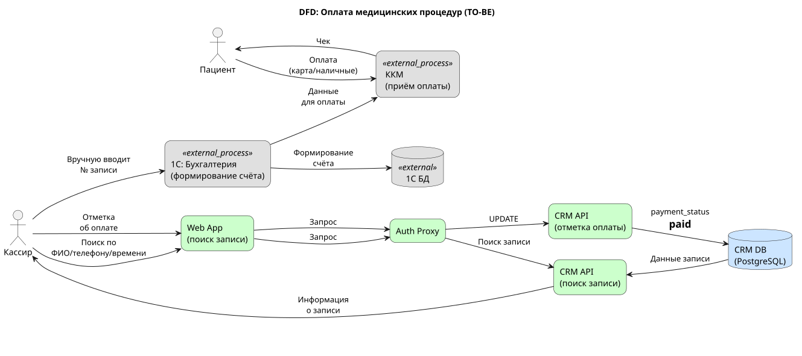
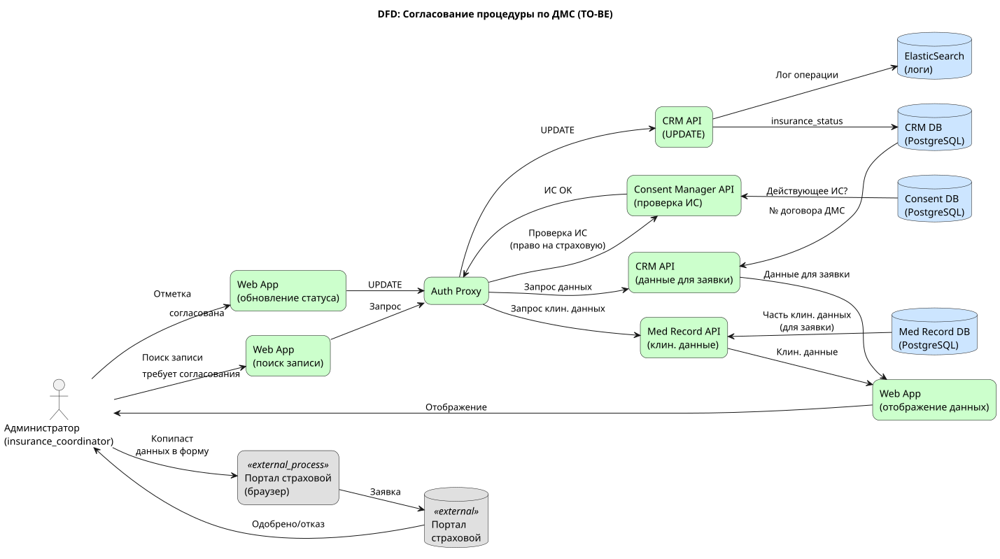
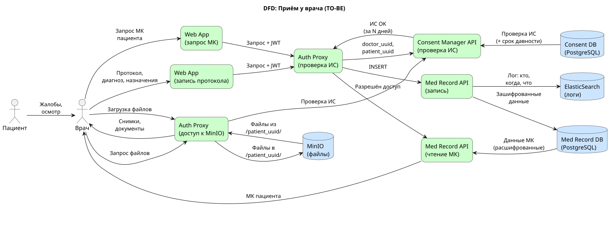
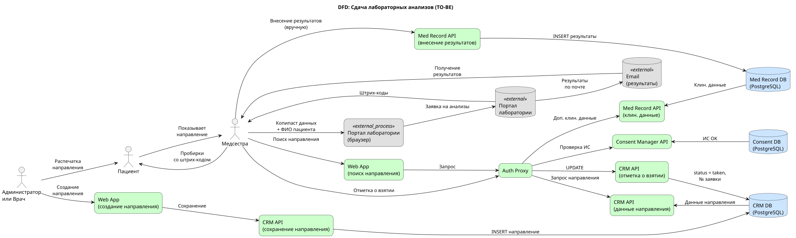
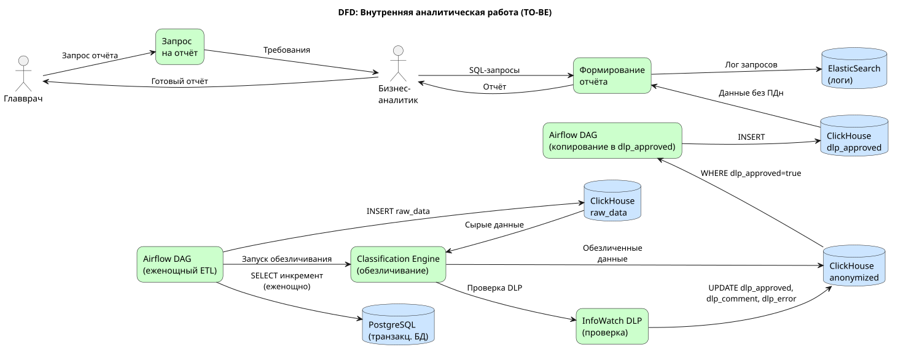
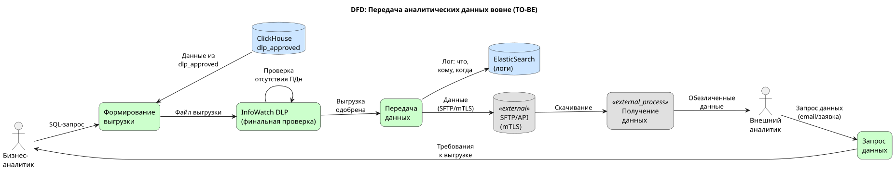

# Задание 2. Проектирование решения

## C4-диаграммы контейнеров

| Диаграмма | PlantUML | SVG | Описание |
|-----------|----------|-----|----------|
| AS-IS | [c4_container_as_is.puml](c4_container_as_is.puml) | [c4_container_as_is.svg](c4_container_as_is.svg) | Текущая архитектура до трансформации |
| TO-BE | [c4_container_to_be.puml](c4_container_to_be.puml) | [c4_container_to_be.svg](c4_container_to_be.svg) | Целевая архитектура после трансформации |

### AS-IS: текущая архитектура



### TO-BE: целевая архитектура



## Новые элементы архитектуры: основная часть

Здесь на нашу диаграмму контекстов добавятся следующие сервисы (основную часть сервисов развернём в kubernetes, арендовав под это несколько [серверов](https://selectel.ru/services/dedicated/config/?uuid=6b1f8b59-6cb0-415d-9b34-e88ddfd6fc0f) в дата-центра, kuberntes на сервера поставим сами).

### CRM API

Этот сервис работает со следующими данными:

- паспортные данные пациентов;  
- записи пациентов (к какому специалисту и на какое время);  
- данные сотрудников клиники / сети клиник;  
- данные о расписании сотрудников.

#### Ограничения по доступу к данным

Проверка пользователя и его роли: здесь мы проверяем JWT и смотрим, что у него есть роль “doctor”, “nurse” или “receptionist”. Или – что пользователь запрашивает инфу о себе самом.

При поиске пациентов по части фамилии / телефона / паспорта – нужно возвращать не более 30-50 строк (чтобы труднее было скопировать базу пациентов полностью). Это будем делать внутри сервиса.

Количество запросов в секунду от одного пользователя будем ограничивать извне:

- или через Istio Ingress Controller (если будем использовать istio);  
- или просто в нашем API Gateway / авторизующего прокси.

Логируем все запросы + заголовки (но не ответы) в ElasticSearch.

### Med Record API

Это сервис управления медицинскими картами пациентов со всеми клиническими данными, как-то:

* протоколы приёмов;  
* диагнозы и назначения;  
* рецепты;  
* ссылки на медицинские документы в MinIO (документы раскладываются по папкам с `patient_uuid`).

#### Ограничения по доступу к данным

Проверка пользователя и его роли: здесь мы проверяем, что к медкарте пытается доступиться или сам пациент (см. UUID юзера по JWT), или юзер с ролью “врач” в JWT. Это перестраховка, т.к. эти вещи уже должны быть проверены на уровне API Gateway / авторизующего прокси (и там ещё и должно быть проверено, что у врача есть действующее информированное согласие) – но не повредит.

Количество обрабатываемых запросов в секунду от одного пользователя будем ограничивать извне:

- или через Istio Ingress Controller (если будем использовать istio);  
- или просто в нашем API Gateway / авторизующего прокси.

Логируем все запросы + заголовки (но не ответы) в ElasticSearch.

### Consent Manager API

Этот сервис будет управлять информированным согласием (ИС) пользователей на доступ к его персональным данным из медицинской карты. ИС будет иметь следующую структуру:

* время выдачи ИС;  
* время начала ИС (если NULL, то от самого сотворения мира);  
* время истечения ИС (если NULL, то до конца времён);  
* UUID пациента, который его выдал;  
* UUID специалиста, для которого он выдан (если NULL, то считаем, что выдано всем врачам и специалистам);  
* UUID специалиста, который создал ИС (если его создал не сам пациент через веб-приложения, а администратор в регистратуре);  
* время отзыва ИС пользователем (если NULL, то считаем, что оно не отзывалось).

Индексируемся по: (пациенту, врачу, времени истечения ИС)

Частые запросы:

* `GET /consents/{patient_uuid}/{specialist_uuid}?active_now=true&include_null_specialist=true` (наш API Gateway или авторизующий прокси будет обращаться именно сюда).  
* `PUT /consents/{patient_uuid}/specialist_uuid` – выдача информированного согласия на какое-то время (по умолчанию при записи через регистратуру – выдавать всем специалистам на 30 дней).

Основная БД будет Postgres, кэшировать ИС будем в Redis (в течение суток).

Если нужно, устаревшие и деактивированные ИС будем переносить в отдельную архивную Postgres-таблицу для ускорения индексов в основной.

#### Методы защищённого хранения данных

* Хешируем ключи в Redis c какой-нибудь salt.  
* Значения в Redis будем шифровать с помощью FERNET.  
* Соль и ключи держим в Vault.

### Auth Proxy

В прошлый раз, для вящей сохранности медицинских данных, нам предъявили жёсткие требования: не хранить Refresh Token на стороне пользователя, а хранить строго на стороне сервера. В прошлый раз я проектировал для этого т.н. авторизующее прокси, которое полностью берёт на себя общение с Keycloak, а юзеру только выставляет специальное куки `session_id`.

Воспользуемся этим же приёмом и в этот раз, благо одновременная нагрузка у нас ожидается небольшой.

Но: в этот раз наше прокси будет не просто навешивать JWT от keycloak на его запросы, передавая их дальше к нижележащим сервисам. В этот раз (хотя бы перед проксированием Med Record API и MinIO) мы будем обращаться к Consent Manager API – и искать, есть ли у юзера действующее информированное согласие на доступ к данным. Исключение – если юзер сам пациент и просматривает свои собственные данные.

* Если у нас роль “receptionist” – отказываем сразу.  
* Если роль “nurse” или “doctor” – ищем по пациенту действующее информированное согласие на специалиста (или общее).  
* Если роль “patient” – проверяем, что пациент пытается доступиться конкретно к своим данным.

Соответственно, у нас здесь не чистый RBAC, а гибридная модель (RBAC + ABAC).

Токены держим в Redis.

#### Методы защищённого хранения данных

* Хешируем ключи в Redis c какой-нибудь salt.  
* Значения в Redis будем шифровать с помощью FERNET.  
* Соль и ключи держим в Vault.

### Keycloak Identity Provider

Для личного состава клиники или сети – добавляем User Federation по нашему Active Directory.

### MinIO

Здесь мы будем хранить разнообразные документы, прикладываемые к медицинским картам пациентов.

Документы разложим по папкам вида `/patient_uuid/`

На уровне самого MinIO доступ сделаем публичным, регулировать доступ к нему всё равно будет наше Auth Proxy.

### Vault

Используем его для хранения ключей и паролей.

### ElasticSearch

Используем его для хранения логов от всех подов.

### Сервисы НЕ в kubernetes

#### Active Directory

Она требует Windows, под неё арендуем отдельную [Windows-VPS.](https://selectel.ru/services/cloud/servers/vps-windows/)

#### Сервисы 1С

* “1C: Бухгалтерия”: переходим в клиент-серверный режим с размещением сервера приложений в дата-центре.  
* “1С: Склад: тоже переходим в клиент-серверный режиме с размещением сервера приложений в дата-центре.

На kubernetes развернуться не получится: если любой сервер “1С: Приложение” стартует на другой ноде, чем стартовал в прошлый раз, нужно вручную вводить новый ПИН-код (и их дают ограниченное количество). Т.е. легко и незаметно перепрыгивать с ноды на ноду, чем славен kubernetes, мы не сможем.

Для них арендуем парочку Linux-VPS средней мощности.

## Аналитический слой для работы с данными

Здесь добавятся ещё сервисы: ClickHouse, Debezium + Kafka, Apache Airflow и OpenMetadata. Всё размещаем в Kubernetes.

### ClickHouse

Используем её в качестве аналитической БД (чтобы не нагружать транзакционные БД аналитическими запросами при составлении отчётов).

### Kafka и Debezium CDC

Их мы будем использовать для захвата данных из наших транзакционных Postgres-баз.

### Apache Airflow

Используем для оркестрации ETL-пайплайнов:
- Получение CDC-событий из Kafka
- Запуск Classification Engine для токенизации и классификации ПДн
- Интеграция с DLP-системой для финальной проверки
- Загрузка обработанных данных в ClickHouse
- Обновление тегов в OpenMetadata

DAG-пайплайн:
```
[Kafka CDC] → [Classification Engine] → [InfoWatch DLP] → [ClickHouse dlp_approved]
                      ↓
              [OpenMetadata теги]
```

### OpenMetadata

Это средство мы будем использовать в качестве каталога данных для тегирования полей в БД.

### Classification Engine

Собственный сервис классификации данных (см. подробнее в [task_6_data_classification_engine](../task_6_data_classification_engine/README.md)):
- ML-модель для автоматического обнаружения ПДн в текстовых полях
- Токенизация идентифицирующих полей
- Интеграция с InfoWatch DLP для финальной проверки
- Обновление тегов в OpenMetadata

## Сервисы материнской компании (SOC)

Для обеспечения информационной безопасности используем **сторонние сервисы материнской компании**, развёрнутые в их SOC (Security Operations Center).

### MaxPatrol SIEM (Positive Technologies)

Система управления событиями информационной безопасности:
- Сбор событий из ElasticSearch (логи всех сервисов)
- Сбор событий аутентификации из Auth Proxy
- Корреляция событий, обнаружение аномалий
- Формирование инцидентов ИБ

Интеграция:
- ElasticSearch → MaxPatrol (Syslog/API)
- Auth Proxy → MaxPatrol (Syslog)

### InfoWatch Traffic Monitor (DLP)

Система предотвращения утечек данных:
- Сканирование файлов в MinIO через ICAP-протокол
- Проверка выгрузок из ClickHouse перед передачей вовне
- Интеграция с Classification Engine для верификации токенизации

Интеграция:
- MinIO → InfoWatch (ICAP)
- Classification Engine → InfoWatch (REST API)
- ClickHouse → InfoWatch (аудит выгрузок)

## Тегирование данных

### Тегирование данных в транзакционных БД

Для полей наших транзакционных PostgreSQL-БД вводим следующую классификацию тегов в OpenMetadata:

* `identifying_fields`: идентифицирующие поля (например, ФИО и email), их надо хранить хотя бы в отдельной схеме в зашифрованном виде – и никогда не вытаскивать более 30-50 записей;  
* `extra_protected_fields`: особо охраняемые поля (например, метка о ВИЧ-статусе) – они не относятся к идентифицирующим, но тоже надо шифровать и просто так не показывать;  
* `med_record_fields`: поля медкарты: поля, которые относятся к медкарте, их нужно просто не показывать сотрудникам регистратуры, а показывать только лечащему врачу (другим врачам тоже не показывать);  
* `dlp_needed`: поля, которые надо прогонять через DLP-систему на предмет того, не указал ли кто из врачей, например, ФИО пациента в поле "назначение", заполняя протокол приёма;  
* `dlp_not_needed`: поля, которые можно не прогонять через DLP.

### Тегирование данных в аналитических БД (ClickHouse)

Исходные предпосылки:
- считаем, что часто будет нужно прибегать к внешней консультации и раздавать данные вовне;  
- считаем, что с увеличением штата доступ к диагнозам пациента должен иметь только его лечащий врач;  
- считаем, что мы хотим развивать направление бизнес-аналитики, и иногда тоже раздавать данные вовне (например, показывать их бизнес-аналитикам материнской компании).

Для аналитических задач используем ClickHouse. Слои данных:

- `raw_sources`: сырые текстовые данные, импортированные из МК пациентов (содержат ПД, прямой доступ извне к ним запрещён), для которых мы будем выставлять теги `pii` для идентифицирующих полей;  
- `raw_sources_with_tokenization`: источники с дополнительными полями, где кроме идентифицирующих полей вроде "email" или "телефон" добавлены поля "токен адреса" или "токен телефона" (с помощью нашего ETL-процесса, вероятно с применением внешней DLP), этим полям выставляется тег `pii_hidden`.  
  - для всех прочих полей, пришедших из исходных таблиц, также вводятся поля `.{source_fld_name}_pii_hidden`, где идентифицирующая информация найдена и удалена нашим ETL-процессом (этим полям выставляется тег `pii_hidden`).  
- `dlp_approved_sources`: копия raw\_sources\_with\_tokenization после сканирования DLP-системой:  
  - DLP-система копирует только поля с тегом `pii_hidden`;  
  - перед копированием инкремента данных DLP-система удостоверится, что в этих полях точно нет идентифицирующих данных;  
  - если есть идентифицирующие данные, то копирования не произойдёт, и дата-инженеру придётся доработать код токенизации на предыдущем шаге.

Для аналитики раздаём вовне только `dlp_approved_sources`. К остальным схемам даём доступ для роли "admin" или "pii\_read".

### Тегирование файлов в файлохранилище (MinIO)

Для файлов в файлохранилище тоже введём набор тегов, которые тоже будем хранить в OpenMetadata:

- `scanned_by_dlp`: для файлов, которые уже просмотрены нашей DLP-системой;  
- `pii_found`: для файлов, где DLP-система нашла идентифицирующие поля;  
- `pii_not_found`: для файлов, где не найдено идентифицирующих данных;  
- `pii_auto_hidden`: для обезличенных файлов, где идентифицирующие данные автоматически скрыты DLP-системой (например, рентгеновские снимки, где подписи с ФИО пациента автоматически заменены на подписи с его ID).

Вовне (для целей аналитики или внешней консультации) разрешим раздавать только файлы с тегом `scanned_by_dlp` and (`pii_not_found` or `pii_auto_hidden`).
Для таких файлов будем создавать отдельную роль со временным доступом и авторизовывать через наше Auth Proxy.

## Автоматизированный контроль доступа к данным

На этом этапе должен появиться набор юнит-тестов, которые будут делать к нашему REST API запросы с попыткой вытащить те данные, которые не должно быть можно вытащить. Например, если тётенька из регистратуры попытается получить всех пациентов, последовательно вводя первые слоги фамилий – или если дяденька-доктор попытается получить доступ к чужим пациентам.

Перед каждым релизом стоит запускать LLM класса Claude Sonnet, которая будет проверять соответствие набора юнит-тестов — и набора тегов в OpenMetadata. И давать свой вердикт: не надо ли нам добавить юнит-тестов, потому что какие-то поля или таблицы остались непокрытыми.

## Процессы и DFD в новой архитектуре

Ниже описаны основные бизнес-процессы в новой архитектуре с DFD-диаграммами потоков данных.

### 1. Регистрация пациента (TO-BE)

Основные участники: пациент, администратор в регистратуре.

* Пациент приходит в регистратуру / звонит / регистрируется через веб-приложение.
* Администратор (или сам пациент через веб-приложение) вводит данные в форму регистрации.
* Веб-приложение отправляет запрос через Auth Proxy → CRM API.
* CRM API проверяет, нет ли дубликата (поиск по телефону/email/паспорту).
* CRM API сохраняет данные пациента в PostgreSQL (идентифицирующие данные — в зашифрованном виде).
* CRM API создаёт запись о пациенте в MinIO (папка для будущих документов МК).
* Все действия логируются в ElasticSearch.



**Оставшиеся риски:**
- **Зависимость от внешних сервисов:** при недоступности Keycloak или CRM API регистрация невозможна
- **Человеческий фактор:** администратор может ошибиться при вводе данных

---

### 2. Запись на приём (TO-BE)

Основные участники: пациент, администратор, врач.

* Пациент записывается через веб-приложение / звонит в регистратуру / врач создаёт повторную запись.
* Запрос проходит через Auth Proxy (проверка JWT).
* CRM API проверяет наличие пациента и создаёт запись в таблице `appointments`.
* При записи автоматически создаётся черновик информированного согласия в Consent Manager API.
* Уведомление отправляется пациенту (email/SMS через внешний сервис).
* Все действия логируются в ElasticSearch.



**Оставшиеся риски:**
- **Коллизии времени:** два пациента могут попытаться записаться на одно время (решается транзакциями и блокировками в PostgreSQL)
- **Зависимость от внешних сервисов:** при недоступности SMS-шлюза уведомление не дойдёт

---

### 3. Оплата медицинских процедур (TO-BE)

Основные участники: пациент, кассир.

* Кассир находит запись пациента через CRM API (поиск по ФИО/телефону).
* Кассир формирует счёт, данные передаются в 1С:Бухгалтерия через API-интеграцию.
* 1С загружает данные в ККМ, пациент оплачивает.
* Статус оплаты обновляется в CRM API.
* Все операции логируются в ElasticSearch.



**Оставшиеся риски:**
- **Зависимость от 1С:** при недоступности сервера 1С оплата невозможна
- **PCI DSS:** платёжные данные обрабатываются ККМ, но необходим регулярный аудит

---

### 4. Согласование процедуры со страховой (ДМС) (TO-BE)

Основные участники: пациент, администратор, страховая компания.

* Администратор формирует заявку на согласование через CRM API.
* CRM API передаёт **минимально необходимые данные** (код процедуры, номер полиса) на портал страховой через защищённый API.
* Ответ от страховой сохраняется в CRM API.
* Статус записи обновляется.
* Все передаваемые данные логируются для аудита.



**Оставшиеся риски:**
- **Передача данных третьим лицам:** хотя данные минимизированы, они всё ещё передаются на внешний портал
- **Зависимость от страховой:** при недоступности портала согласование невозможно

---

### 5. Приём у врача (TO-BE)

Основные участники: пациент, врач.

* Врач авторизуется через Keycloak (AD Federation).
* Auth Proxy проверяет наличие действующего информированного согласия через Consent Manager API.
* При наличии согласия врач получает доступ к МК пациента через Med Record API.
* Врач добавляет протокол приёма, диагноз, назначения — данные сохраняются в PostgreSQL (Med Record DB).
* Документы (снимки, файлы) загружаются в MinIO.
* Все действия логируются в ElasticSearch с указанием врача и времени.



**Оставшиеся риски:**
- **Врачебная тайна:** доступ ограничен информированным согласием, но врач всё равно видит полную МК пациента
- **Человеческий фактор:** врач может внести некорректные данные

---

### 6. Сдача лабораторных анализов (TO-BE)

Основные участники: пациент, медсестра, лаборатория-партнёр.

* Медсестра авторизуется, Auth Proxy проверяет согласие.
* Med Record API предоставляет направление на анализы.
* CRM API формирует заявку для лаборатории с **минимально необходимыми данными** (ID пациента, виды анализов).
* Лаборатория возвращает результаты через защищённый API.
* Результаты сохраняются в Med Record API и MinIO.
* Пациент получает уведомление и может посмотреть результаты в личном кабинете.



**Оставшиеся риски:**
- **Передача данных партнёру:** данные минимизированы, но ФИО всё равно передаётся (требования прослеживаемости)
- **Зависимость от внешней системы:** при недоступности API лаборатории процесс останавливается

---

### 7. Внутренняя аналитическая работа (TO-BE)

Основные участники: главврач, бизнес-аналитик.

* Главврач формирует запрос на отчёт.
* Бизнес-аналитик работает **только с ClickHouse** (слой `dlp_approved_sources`), где данные обезличены.
* Данные в ClickHouse поступают через Debezium CDC → Kafka → ETL с токенизацией.
* Отчёты формируются без доступа к идентифицирующим данным.
* Все запросы к ClickHouse логируются.



**Оставшиеся риски:**
- **Качество обезличивания:** если ETL некорректно токенизирует данные, ПДн могут попасть в `dlp_approved_sources`
- **Человеческий фактор:** аналитик может попросить прямой доступ к `raw_sources`

---

### 8. Передача аналитических данных вовне (TO-BE)

Основные участники: внешний аналитик, бизнес-аналитик клиники, DLP-система.

* Внешний аналитик запрашивает данные.
* Бизнес-аналитик формирует выгрузку из ClickHouse (только `dlp_approved_sources`).
* Выгрузка проходит через DLP-систему, которая проверяет отсутствие ПДн.
* Если DLP одобрила — данные передаются через защищённый канал (SFTP/API с mTLS).
* Внешнему аналитику создаётся временная роль с ограниченным сроком доступа.
* Все передачи данных логируются для аудита.



**Оставшиеся риски:**
- **Обход DLP:** при ошибке в DLP-правилах ПДн могут быть переданы
- **Контроль после передачи:** после передачи данных контроль над ними теряется