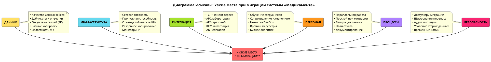

`Generated by Claude Opus 4.5`

# Задание 4. Оценка узких мест при миграции

## Описание текущей системы

**Важно:** в компании «Медикаменте» **не было монолитной системы** в классическом понимании. Текущая архитектура представляет собой:

- **Разрозненные Excel-файлы** на общей сетевой файловой системе (списки пациентов, журналы записей)
- **Папки с документами** медицинских карт пациентов на сетевой ФС
- **1С:Бухгалтерия** в файловом режиме (работает с базой на той же сетевой ФС)
- **1С:Склад** в файловом режиме
- **Exchange Mail Server** для корпоративной почты
- **Мессенджеры** для внутренней коммуникации (неконтролируемый канал)

Это архитектура уровня 2003 года без централизованного хранилища данных, без разграничения доступа, без шифрования, без аудита.

## Цели миграции

1. **Перейти на микросервисную архитектуру** с централизованными БД (PostgreSQL) и файловым хранилищем (MinIO)
2. **Внедрить разграничение доступа** (RBAC + ABAC) через Keycloak и Auth Proxy
3. **Обеспечить шифрование данных** at rest и in transit
4. **Внедрить аудит** всех операций с данными (ElasticSearch)
5. **Создать аналитический слой** (ClickHouse) с обезличиванием данных
6. **Обеспечить соответствие 152-ФЗ**

## Ключевые процессы и компоненты, затрагиваемые миграцией

### Данные
- **Списки пациентов:** Excel → PostgreSQL (CRM DB)
- **Журналы записей:** Excel → PostgreSQL (CRM DB)
- **Медицинские карты:** папки на ФС → PostgreSQL (Med Record DB) + MinIO
- **Финансовые данные:** 1С файловый режим → 1С клиент-серверный режим

### Процессы
- Регистрация пациентов
- Запись на приём
- Ведение медицинских карт
- Оплата услуг
- Согласование ДМС
- Сдача анализов
- Внутренняя аналитика
- Передача данных вовне

### Инфраструктура
- Локальный файловый сервер → Kubernetes в дата-центре
- Рабочие станции с прямым доступом к ФС → Веб-приложения через API
- 1С файловый режим → 1С клиент-серверный режим на VPS

---

## Диаграмма Исикавы (Рыбья кость)

Источник: [ishikawa_migration_bottlenecks.drawio](ishikawa_migration_bottlenecks.drawio)

---

## Категории узких мест и выявленные проблемы

### 1. Данные (Data)

| Проблема | Описание | Критичность |
|----------|----------|-------------|
| **Качество данных в Excel** | Дубликаты записей, опечатки в ФИО, неполные данные, разные форматы дат | Высокая |
| **Отсутствие связей между данными** | Нет внешних ключей между пациентами, записями и МК — связи только по ФИО | Высокая |
| **Кодировки и форматы** | Excel-файлы могут быть в разных кодировках (Windows-1251, UTF-8) | Средняя |
| **Объём данных для миграции** | Неизвестен точный объём, возможны скрытые файлы и дубликаты | Средняя |
| **Целостность МК** | Документы в папках могут быть повреждены, отсутствовать, дублироваться | Высокая |

### 2. Инфраструктура (Infrastructure)

| Проблема | Описание | Критичность |
|----------|----------|-------------|
| **Сетевая связность** | Все филиалы должны иметь стабильный доступ к дата-центру | Высокая |
| **Пропускная способность** | При миграции файлов МК нужно передать большой объём данных | Средняя |
| **Отказоустойчивость** | Kubernetes требует минимум 3 ноды для HA, это дополнительные затраты | Средняя |
| **Резервное копирование** | Нужно настроить бэкапы PostgreSQL, MinIO, ClickHouse | Высокая |
| **Мониторинг** | Нужна инфраструктура для мониторинга (Prometheus, Grafana) | Средняя |

### 3. Интеграция (Integration)

| Проблема | Описание | Критичность |
|----------|----------|-------------|
| **1С интеграция** | Переход 1С в клиент-серверный режим требует лицензий и настройки | Высокая |
| **Интеграция с лабораторией** | Нужно договориться о новом API вместо веб-интерфейса | Средняя |
| **Интеграция со страховой** | Нужно договориться о минимизации передаваемых данных | Средняя |
| **ККМ интеграция** | Кассовые аппараты должны работать с новой системой через 1С | Высокая |
| **Active Directory** | Нужно настроить User Federation в Keycloak | Средняя |

### 4. Персонал (People)

| Проблема | Описание | Критичность |
|----------|----------|-------------|
| **Обучение сотрудников** | Все сотрудники должны освоить новый веб-интерфейс | Высокая |
| **Сопротивление изменениям** | «Раньше всё работало, зачем менять?» | Средняя |
| **Нехватка IT-специалистов** | Для поддержки Kubernetes нужны DevOps-инженеры | Высокая |
| **Врачи и медсёстры** | Должны освоить новую систему без потери качества работы | Высокая |
| **Бизнес-аналитик** | Должен освоить ClickHouse вместо Excel | Средняя |

### 5. Процессы (Process)

| Проблема | Описание | Критичность |
|----------|----------|-------------|
| **Параллельная работа** | Период, когда работают обе системы — двойной ввод данных | Высокая |
| **Простой при миграции** | Невозможно мигрировать данные на лету без остановки | Высокая |
| **Валидация данных** | Нужно проверить корректность миграции для каждого пациента | Высокая |
| **Откат при ошибках** | Нужен план отката к Excel-файлам при критических ошибках | Высокая |
| **Документирование** | Нужно обновить все инструкции и регламенты | Средняя |

### 6. Безопасность (Security)

| Проблема | Описание | Критичность |
|----------|----------|-------------|
| **Доступ во время миграции** | Кто имеет доступ к данным в процессе переноса? | Высокая |
| **Шифрование при переносе** | Данные должны передаваться по защищённым каналам | Высокая |
| **Аудит миграции** | Нужно логировать все операции миграции | Средняя |
| **Удаление старых данных** | После миграции Excel-файлы должны быть безопасно удалены | Средняя |
| **Временные копии** | В процессе миграции создаются временные копии — их тоже нужно защитить | Средняя |

---

## Рекомендации по устранению узких мест

### Приоритет 1 (Критические — решить до начала миграции)

| № | Мера | Категория | Описание |
|---|------|-----------|----------|
| 1 | **Аудит и очистка данных** | Данные | Провести полный аудит Excel-файлов: найти дубликаты, исправить опечатки, привести к единому формату. Создать уникальные ID для пациентов |
| 2 | **Тестовая миграция** | Процессы | Провести миграцию на тестовом стенде с копией данных. Выявить проблемы до боевой миграции |
| 3 | **План отката** | Процессы | Разработать детальный план отката к Excel-файлам. Хранить бэкап исходных файлов минимум 6 месяцев |
| 4 | **Обучение ключевых пользователей** | Персонал | Обучить 2-3 «амбассадоров» из каждого отдела, которые будут помогать коллегам |
| 5 | **Настройка инфраструктуры** | Инфраструктура | Развернуть Kubernetes-кластер, настроить мониторинг, бэкапы, VPN до начала миграции |

### Приоритет 2 (Важные — решить в первую неделю миграции)

| № | Мера | Категория | Описание |
|---|------|-----------|----------|
| 6 | **Интеграция с 1С** | Интеграция | Перевести 1С в клиент-серверный режим, протестировать интеграцию с ККМ |
| 7 | **Валидация данных** | Данные | Автоматизированная проверка: сравнение количества записей, контрольных сумм |
| 8 | **Минимизация простоя** | Процессы | Планировать миграцию на выходные, предупредить пациентов о возможных задержках |
| 9 | **Защита данных при переносе** | Безопасность | Использовать зашифрованные каналы, ограничить круг лиц с доступом к данным миграции |
| 10 | **AD Federation** | Интеграция | Настроить синхронизацию пользователей из Active Directory в Keycloak |

### Приоритет 3 (Желательные — решить в первый месяц)

| № | Мера | Категория | Описание |
|---|------|-----------|----------|
| 11 | **Интеграция с лабораторией** | Интеграция | Договориться о переходе на API вместо веб-интерфейса |
| 12 | **Массовое обучение** | Персонал | Провести обучение для всех сотрудников после стабилизации системы |
| 13 | **Документирование** | Процессы | Обновить все инструкции, создать FAQ для сотрудников |
| 14 | **Удаление старых данных** | Безопасность | Безопасно удалить Excel-файлы после подтверждения успешной миграции |
| 15 | **Найм DevOps** | Персонал | Нанять или обучить специалиста для поддержки Kubernetes |

---

## Матрица рисков

| Риск | Вероятность | Влияние | Приоритет | Меры митигации |
|------|-------------|---------|-----------|----------------|
| Потеря данных при миграции | Средняя | Критическое | 1 | Бэкапы, тестовая миграция, валидация |
| Простой клиники | Высокая | Высокое | 1 | Миграция в выходные, план отката |
| Ошибки в данных после миграции | Высокая | Среднее | 2 | Валидация, период параллельной работы |
| Сопротивление персонала | Средняя | Среднее | 2 | Обучение, амбассадоры, поддержка |
| Проблемы с интеграцией 1С | Средняя | Высокое | 1 | Тестирование на стенде, план Б |
| Нехватка пропускной способности | Низкая | Среднее | 3 | Миграция в ночное время, сжатие данных |

---

## Заключение

Основные узкие места при миграции компании «Медикаменте»:

1. **Качество исходных данных** — Excel-файлы без структуры, дубликаты, опечатки
2. **Человеческий фактор** — сотрудники привыкли к старой системе
3. **Интеграция с 1С** — критически важный компонент для финансовых операций
4. **Обеспечение непрерывности работы** — клиника не может остановиться на несколько дней

Ключевой фактор успеха — **тщательная подготовка**: аудит данных, тестовая миграция, обучение персонала и детальный план отката.
