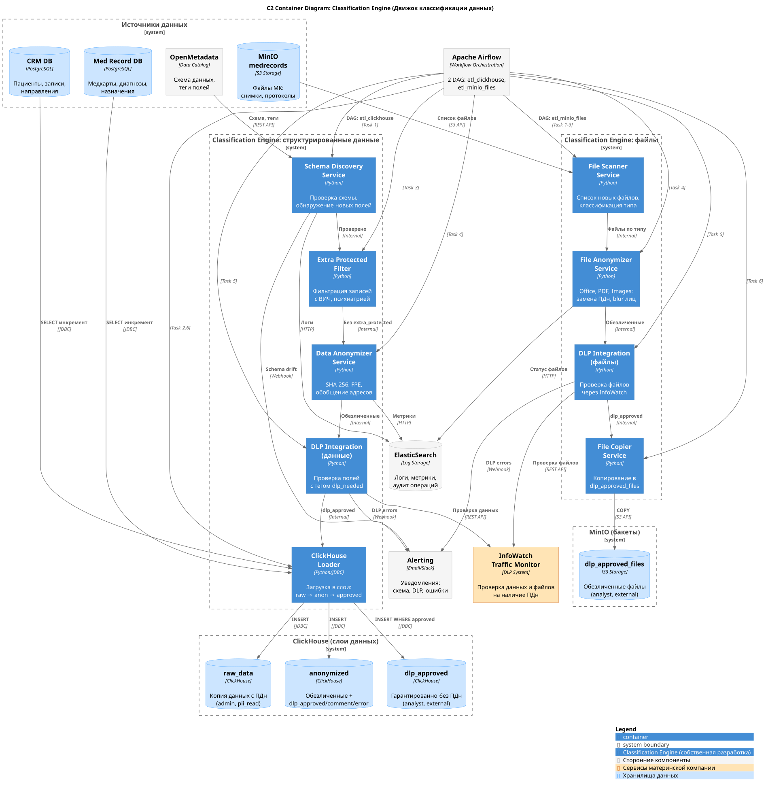

# Задание 6. Классификация данных

## Движок классификации данных (Classification Engine)

Движок обеспечивает **автоматическую классификацию и обезличивание персональных данных** перед их загрузкой в аналитическое хранилище в соответствии с принципами Privacy by Design.

Движок обрабатывает два типа данных:
1. **Структурированные данные** из транзакционных БД → загружаются в **ClickHouse**
2. **Файлы** из MinIO (документы, снимки) → копируются в отдельный бакет **dlp_approved_files**

## C2-диаграмма (Container Diagram) движка классификации



Источник: [classification_engine_c2.puml](classification_engine_c2.puml)

---

## Исходная проблема

**Структуры данных на входе:**
- Подвержены **структурным изменениям** (новые поля, изменение типов)
- **Не размечены** на предмет класса конфиденциальности
- Содержат **ПДн в неожиданных местах** (врач может написать ФИО пациента в поле "назначение")

**Требования:**
- Данные для внешней аналитики должны быть **гарантированно обезличены**
- Особо охраняемые данные (психиатрия, ВИЧ-статус) **не должны попадать** во внешнюю аналитику вообще

---

## Часть 1. Обработка структурированных данных (ClickHouse)

### Слои данных в ClickHouse

```
┌─────────────────────────────────────────────────────────────────────────────────┐
│                              ClickHouse                                         │
├─────────────────────────────────────────────────────────────────────────────────┤
│  raw_data (схема)                                                               │
│  ├── Копия данных из транзакционных БД (с ПДн)                                  │
│  ├── Теги OpenMetadata: identifying_fields, extra_protected, med_record, etc.  │
│  └── Доступ: только admin, pii_read                                            │
├─────────────────────────────────────────────────────────────────────────────────┤
│  anonymized (схема)                                                             │
│  ├── Обезличенные данные (ФИО → хеш, телефон → хеш, адрес → регион)             │
│  ├── Доп. поля: dlp_approved (bool), dlp_comment (text), dlp_error (text)       │
│  ├── Записи с extra_protected_fields — УДАЛЕНЫ (не копируются)                  │
│  └── Доступ: admin, analyst                                                     │
├─────────────────────────────────────────────────────────────────────────────────┤
│  dlp_approved (схема)                                                           │
│  ├── Только строки с dlp_approved=true (гарантированно без ПДн)                 │
│  ├── Записи с extra_protected_fields — отсутствуют                              │
│  └── Доступ: analyst, external_analyst                                          │
└─────────────────────────────────────────────────────────────────────────────────┘
```

### Теги полей в OpenMetadata

Используем следующую классификацию (см. также [task_2/README.md](../task_2_design/README.md#тегирование-данных)):

| Тег | Описание | Действие при обезличивании |
|-----|----------|---------------------------|
| `identifying_fields` | ФИО, email, телефон, паспорт | SHA-256 хеш с salt |
| `extra_protected_fields` | ВИЧ-статус, психиатрия, наркология | **Удаление всей записи** |
| `med_record_fields` | Диагнозы, назначения (кроме extra_protected) | Копируются как есть |
| `dlp_needed` | Поля, где врач мог вписать ПДн | Проверка через InfoWatch DLP |
| `dlp_not_needed` | Коды МКБ-10, суммы, даты | Копируются без проверки DLP |

### ETL-пайплайн для ClickHouse (Airflow DAG)

Запускается **еженощно**, когда нагрузка на транзакционные БД минимальна.

```
┌─────────────────────────────────────────────────────────────────────────────────┐
│                    Airflow DAG: etl_clickhouse (еженощно)                       │
│                                                                                 │
│  ┌──────────────┐   ┌──────────────┐   ┌──────────────┐   ┌──────────────┐      │
│  │ 1. Проверка  │──▶│ 2. Копиров.  │──▶│ 3. Фильтр    │──▶│ 4. Обезлич.  │      │
│  │    схемы     │   │   raw_data   │   │ extra_prot.  │   │    Engine    │      │
│  └──────────────┘   └──────────────┘   └──────────────┘   └──────┬───────┘      │
│         │                                                        │              │
│         ▼ (ошибка)                                               ▼              │
│  ┌──────────────┐                                         ┌──────────────┐      │
│  │ Уведомление  │                                         │ 5. DLP       │      │
│  │ IT-директору │                                         │    проверка  │      │
│  └──────────────┘                                         └──────┬───────┘      │
│                                                                  │              │
│                                                           ┌──────▼───────┐      │
│                                                           │ 6. Копиров.  │      │
│                                                           │ dlp_approved │      │
│                                                           └──────────────┘      │
└─────────────────────────────────────────────────────────────────────────────────┘
```

**Операторы:**

1. **Проверка схемы** — сравнивает схему транзакционных БД со схемой в ClickHouse
   - Если схема изменилась → DAG падает, уведомление IT-директору и бизнес-аналитику
   - Требуется ручная миграция и обновление скриптов обезличивания

2. **Копирование инкремента в raw_data** — SELECT из PostgreSQL → INSERT в ClickHouse

3. **Фильтрация extra_protected** — записи с тегами `extra_protected_fields` (ВИЧ, психиатрия, наркология) **не копируются** в слой `anonymized`

4. **Обезличивание данных** — Classification Engine:
   - Токенизация `identifying_fields`: SHA-256 хеш с salt
   - Обобщение адресов до региона (при необходимости — облачная LLM)
   - Сдвиг дат на ±30 дней
   - Добавление полей: `dlp_approved=null`, `dlp_comment=null`, `dlp_error=null`

5. **Проверка DLP** — InfoWatch Traffic Monitor:
   - Проверяет поля с тегом `dlp_needed`
   - UPDATE `dlp_approved`, `dlp_comment`, `dlp_error`

6. **Копирование в dlp_approved** — только строки с `dlp_approved=true`

---

## Часть 2. Обработка файлов (MinIO)

### Структура бакетов в MinIO

```
MinIO
├── medrecords/                      # Основной бакет (исходные файлы)
│   └── {patient_uuid}/              # Папка пациента
│       ├── 2024-01-15_mrt_head.dcm  # МРТ (DICOM)
│       ├── 2024-02-20_xray.jpg      # Рентген
│       ├── protocol_2024-03-01.docx # Протокол приёма
│       └── lab_results.pdf          # Результаты анализов
│
└── dlp_approved_files/              # Бакет для внешней аналитики
    └── {patient_uuid}/              # UUID остаётся (обезличен)
        ├── 2024-01-15_mrt_head.dcm  # НЕ КОПИРУЕТСЯ (не читается)
        ├── 2024-02-20_xray.jpg      # Лица замазаны
        ├── protocol_2024-03-01.docx # ФИО заменены на UUID
        └── lab_results.pdf          # ФИО заменены на UUID
```

### Правила обезличивания файлов

| Тип файла | Расширения | Действие |
|-----------|------------|----------|
| **Microsoft Office** | .docx, .xlsx, .pptx | Замена ФИО, телефонов, email на `patient_uuid` |
| **PDF** | .pdf | Замена ФИО, телефонов, email на `patient_uuid` (если редактируемый) |
| **Изображения** | .jpg, .png, .tiff | Замена текста с ФИО на `patient_uuid`, замазывание лиц |
| **DICOM (МРТ, КТ)** | .dcm | Пометка `cannot_read=true`, **не копируется** |
| **Прочие** | * | Пометка `cannot_read=true`, **не копируется** |

### Обработка имён файлов и метаданных

**Из имён файлов удаляются:**
- ФИО пациентов (Иванов_Иван → patient_uuid)
- Номера телефонов
- Email-адреса
- Номера паспортов, СНИЛС, ИНН

**Из метаданных файлов (EXIF, XMP, Office properties) удаляются:**
- Автор документа
- Комментарии с ПДн
- История изменений

### ETL-пайплайн для MinIO (Airflow DAG)

```
┌─────────────────────────────────────────────────────────────────────────────────┐
│                    Airflow DAG: etl_minio_files (еженощно)                      │
│                                                                                 │
│  ┌──────────────┐   ┌──────────────┐   ┌──────────────┐   ┌──────────────┐      │
│  │ 1. Список    │──▶│ 2. Фильтр    │──▶│ 3. Класси-   │──▶│ 4. Обезлич.  │      │
│  │ новых файлов │   │ extra_prot.  │   │ фикация типа │   │ по типу      │      │
│  └──────────────┘   └──────────────┘   └──────────────┘   └──────┬───────┘      │
│                                                                  │              │
│                                                           ┌──────▼───────┐      │
│                                                           │ 5. DLP       │      │
│                                                           │    проверка  │      │
│                                                           └──────┬───────┘      │
│                                                                  │              │
│                                                           ┌──────▼───────┐      │
│                                                           │ 6. Копиров.  │      │
│                                                           │ dlp_approved │      │
│                                                           └──────────────┘      │
└─────────────────────────────────────────────────────────────────────────────────┘
```

**Операторы:**

1. **Список новых файлов** — находит файлы, добавленные с прошлого запуска

2. **Фильтр extra_protected** — файлы пациентов с тегом `extra_protected` (психиатрия, ВИЧ) **не копируются**

3. **Классификация типа файла** — определяет формат и выбирает обработчик

4. **Обезличивание по типу:**
   - **Office/PDF**: python-docx, PyPDF2 — поиск и замена ПДн
   - **Изображения**: Tesseract OCR + замена текста, face_recognition + размытие лиц
   - **DICOM**: пометка `cannot_read=true`

5. **DLP-проверка** — InfoWatch проверяет обезличенный файл

6. **Копирование в dlp_approved_files** — только если DLP одобрила

### Таблица статусов файлов

В ClickHouse создаём таблицу `file_anonymization_log`:

| Поле | Тип | Описание |
|------|-----|----------|
| `file_path` | String | Путь к файлу в исходном бакете |
| `patient_uuid` | UUID | UUID пациента |
| `file_type` | String | Тип файла (office, image, dicom, other) |
| `can_read` | Bool | Удалось ли прочитать файл |
| `anonymized` | Bool | Выполнено ли обезличивание |
| `dlp_approved` | Bool | Одобрено ли DLP |
| `dlp_comment` | String | Комментарий DLP |
| `copied_to_approved` | Bool | Скопировано ли в dlp_approved_files |
| `processed_at` | DateTime | Время обработки |

---

## Особо охраняемые данные (extra_protected)

> **Важно:** Записи и файлы, содержащие особо охраняемые данные (диагнозы по психиатрии, ВИЧ-статус, наркология и др.), **не попадают в слои dlp_approved и dlp_approved_files вообще**.

На текущем этапе мы их просто **удаляем** из потока данных для внешней аналитики.

В будущем планируется:
- Отдельный слой `extra_protected_anonymized` с **усиленным обезличиванием**
- Доступ только по специальному разрешению
- Дополнительная проверка DLP

Пока что:
```
extra_protected → НЕ КОПИРУЕТСЯ в anonymized/dlp_approved
```

---

## Сервисы Classification Engine

### 1. Schema Discovery Service

Отвечает за **автоматическое обнаружение новых полей**:
- Сравнивает текущую схему БД с известной схемой в OpenMetadata
- При обнаружении нового поля → помечает как `unclassified`
- Отправляет уведомление дата-инженеру для ручной разметки

### 2. Data Anonymizer Service

Обезличивание данных:
- **ФИО, email, телефон** → SHA-256 хеш с salt
- **Паспорт, СНИЛС, ИНН** → формат-сохраняющее шифрование (FPE)
- **Адреса** → обобщение до региона (при необходимости — облачная LLM)
- **Даты рождения** → сдвиг на ±30 дней

### 3. File Processor Service

Обработка файлов:
- **Office**: python-docx, openpyxl — поиск и замена ПДн
- **PDF**: PyPDF2, pdfplumber — извлечение и замена текста
- **Изображения**: Tesseract OCR + PIL — распознавание и замена текста
- **Лица на фото**: face_recognition → размытие

### 4. DLP Integration Service

Интеграция с InfoWatch Traffic Monitor:
- Отправляет обезличенные данные/файлы на проверку
- Если DLP обнаруживает ПДн → `dlp_approved=false`
- Логирует все срабатывания для анализа

---

## Метрики эффективности классификации

### 1. Качество обезличивания

| Метрика | Описание | Целевое значение |
|---------|----------|------------------|
| **Recall** | Доля обнаруженных ПДн среди всех ПДн | ≥ 99% |
| **DLP Escape Rate** | Доля ПДн, прошедших DLP | 0% |
| **Tokenization Coverage** | % полей с `identifying_fields`, которые обезличены | 100% |

*Recall важнее Precision* — лучше ложно заблокировать, чем пропустить ПДн.

### 2. Метрики обработки файлов

| Метрика | Описание | Целевое значение |
|---------|----------|------------------|
| **File Processing Rate** | % файлов, успешно обработанных | ≥ 80% |
| **Cannot Read Rate** | % файлов, которые не удалось прочитать | мониторинг |
| **Face Detection Accuracy** | Точность обнаружения лиц | ≥ 95% |

### 3. Операционные метрики

| Метрика | Описание | Целевое значение |
|---------|----------|------------------|
| **Processing Time** | Время полного ETL-цикла | < 4 часа |
| **Unclassified Fields** | Количество полей без тега | 0 (после 24ч) |
| **Schema Drift Events** | Количество изменений схемы | мониторинг |

### Как метрики помогают в оптимизации

1. **Низкий Recall** → дообучение моделей, добавление паттернов
2. **Высокий Cannot Read Rate** → добавление новых парсеров файлов
3. **Высокий Processing Time** → масштабирование воркеров Airflow
4. **Schema Drift Events** → триггер для ручной разметки

---

## Масштабируемость (Scalability)

### Текущая архитектура

- **Apache Airflow** — оркестрация DAG (1-2 воркера)
- **Classification Engine** — Python-сервисы в Kubernetes
- **InfoWatch DLP** — сервис материнской компании (SOC)

### При увеличении объёма данных

| Нагрузка | Решение |
|----------|---------|
| **10x записей в БД** | Параллельная обработка партий в Airflow |
| **10x файлов** | Горизонтальное масштабирование File Processor |
| **Сложные форматы** | Добавление новых парсеров, GPU для OCR |

### При увеличении количества пользователей

| Нагрузка | Решение |
|----------|---------|
| **Больше аналитиков** | Шардирование ClickHouse по дате |
| **Внешние аналитики** | Отдельная реплика ClickHouse для `dlp_approved` |
| **Больше файлов** | CDN для раздачи `dlp_approved_files` |

---

## Заключение

Classification Engine обеспечивает:

1. **Privacy by Design** — данные обезличиваются до попадания в аналитику
2. **Многослойность** — raw_data → anonymized → dlp_approved для ClickHouse и MinIO
3. **Защита особо охраняемых данных** — extra_protected не попадают во внешнюю аналитику
4. **Обработка файлов** — Office, PDF, изображения, замазывание лиц
5. **Верификация** — интеграция с InfoWatch DLP
6. **Прослеживаемость** — логирование всех операций
7. **Масштабируемость** — Airflow + Kubernetes
